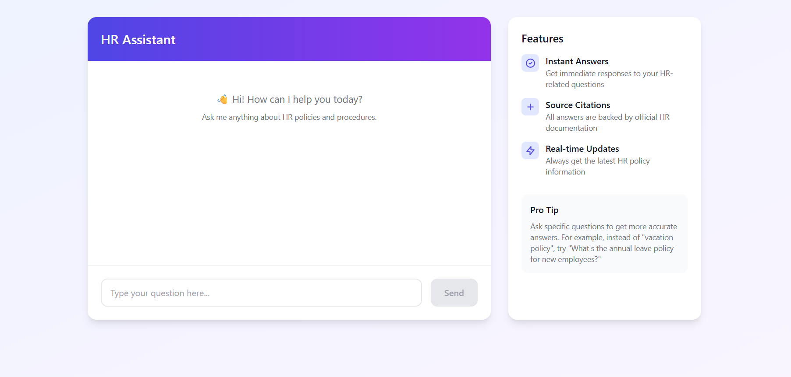
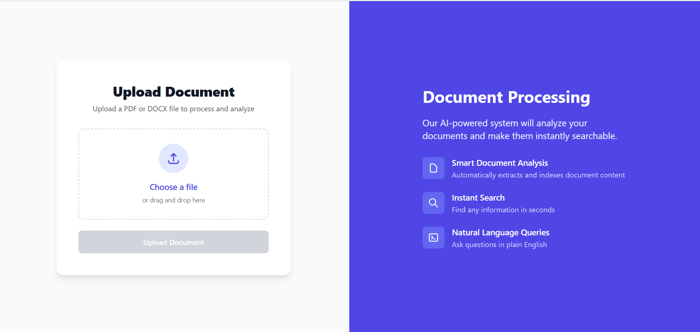
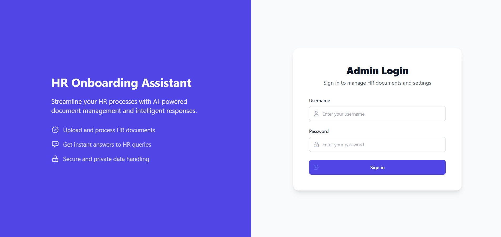

# HR Onboarding Assistant

A full-stack application that helps HR teams manage and query onboarding documentation using AI. Upload PDF and DOCX files and ask questions about their content. The application leverages advanced AI technology to provide instant, accurate responses to HR-related queries while citing relevant sources.

## 🌟 Features

### For Administrators
- 🔒 Secure admin authentication with protected routes
- 📄 Easy document management with drag-and-drop file upload
- 📊 Support for multiple file formats (PDF, DOCX)
- 🔄 Real-time upload progress tracking
- 📝 Automatic document processing and indexing

### For Users
- 🤖 AI-powered question answering with natural language understanding
- 🎯 Relevant source citations with original document references
- 💬 Interactive chat interface with message history
- ⚡ Instant responses with real-time feedback
- 📱 Fully responsive design for all devices

### Technical Features
- 🔍 Vector-based semantic search using Sentence Transformers
- 🧠 Advanced text generation with Gemini 1.5 Pro
- 🗄️ Efficient vector storage with Qdrant
- 🛡️ JWT-based authentication
- 🎨 Modern UI with Tailwind CSS

## 🖼️ Screenshots

### Chat Interface

*Interactive chat interface with AI-powered responses and source citations*

### Document Upload

*Drag-and-drop document upload with progress tracking*

### Login Screen

*Secure admin authentication interface*

## 🛠️ Tech Stack

### Frontend
- **React 18** with Vite for fast development and building
- **TypeScript** for type safety and better developer experience
- **Tailwind CSS** for modern, responsive styling
- **Axios** for efficient API communication
- **React Router v6** for client-side routing
- **React Context** for state management
- **React Hook Form** for form handling

### Backend
- **FastAPI** for high-performance API endpoints
- **LangChain** for robust text processing and AI integration
- **Sentence Transformers** for generating document embeddings
- **Qdrant** for vector similarity search
- **Gemini 1.5 Pro** for advanced text generation
- **PyJWT** for secure authentication
- **Python-Multipart** for file upload handling

## 📁 Project Structure

```bash
hr-onboarding-assistant/
├── backend/
│   ├── main.py          # FastAPI application entry point
│   ├── auth.py          # JWT authentication logic
│   ├── ingest.py        # Document processing pipeline
│   ├── qa.py            # Question answering logic
│   ├── utils/           # Utility functions
│   │   ├── file.py      # File handling utilities
│   │   ├── vector.py    # Vector operations
│   │   └── text.py      # Text processing
│   └── uploads/         # Secure document storage
├── frontend/
│   ├── src/
│   │   ├── components/  # Reusable UI components
│   │   ├── pages/       # Page components
│   │   ├── context/     # React context providers
│   │   ├── hooks/       # Custom React hooks
│   │   ├── utils/       # Utility functions
│   │   └── types/       # TypeScript definitions
│   └── public/          # Static assets
├── project-snapshots/   # Application screenshots
├── .env                 # Environment variables
└── README.md           # Documentation
```

## 🚀 Setup Instructions

### Prerequisites
- Node.js 16+ and npm
- Python 3.8+
- Docker for running Qdrant
- Google Cloud account for Gemini API access

### Step-by-Step Setup

1. Clone the repository:
   ```bash
   git clone https://github.com/yourusername/hr-onboarding-assistant.git
   cd hr-onboarding-assistant
   ```

2. Set up environment variables:
   ```bash
   cp .env.example .env
   # Edit .env with your credentials
   ```

3. Start Qdrant vector database:
   ```bash
   docker run -p 6333:6333 qdrant/qdrant
   ```

4. Set up the backend:
   ```bash
   cd backend
   python -m venv venv
   source venv/bin/activate  # On Windows: venv\Scripts\activate
   pip install -r requirements.txt
   uvicorn main:app --reload --port 8000
   ```

5. Set up the frontend:
   ```bash
   cd frontend
   npm install
   npm run dev
   ```

6. Access the application:
   - Frontend: `http://localhost:5173`
   - Backend API: `http://localhost:8000`
   - API Documentation: `http://localhost:8000/docs`

## ⚙️ Environment Variables

```env
# Frontend (.env)
VITE_API_URL=http://localhost:8000

# Backend (.env)
ADMIN_USERNAME=admin
ADMIN_PASSWORD=your_secure_password
GEMINI_API_KEY=your_gemini_api_key
JWT_SECRET=your_jwt_secret
UPLOAD_DIR=./uploads

# Qdrant Configuration
QDRANT_HOST=localhost
QDRANT_PORT=6333
COLLECTION_NAME=hr_docs
```

## 🔒 Security Considerations

- All API endpoints are protected with JWT authentication
- File uploads are validated and sanitized
- Sensitive environment variables are never exposed to the client
- Document storage is isolated and access-controlled
- Rate limiting is implemented on API endpoints

## 🤝 Contributing

1. Fork the repository
2. Create a feature branch: `git checkout -b feature-name`
3. Commit changes: `git commit -am 'Add feature'`
4. Push to branch: `git push origin feature-name`
5. Submit a Pull Request

## 📝 License

MIT License - feel free to use this project for personal or commercial purposes.

## 👏 Acknowledgments

- [FastAPI](https://fastapi.tiangolo.com/) for the excellent API framework
- [React](https://reactjs.org/) for the frontend framework
- [Tailwind CSS](https://tailwindcss.com/) for the styling system
- [Qdrant](https://qdrant.tech/) for vector similarity search
- [Google Gemini](https://cloud.google.com/vertex-ai/docs/generative-ai/model-reference/gemini) for AI capabilities 